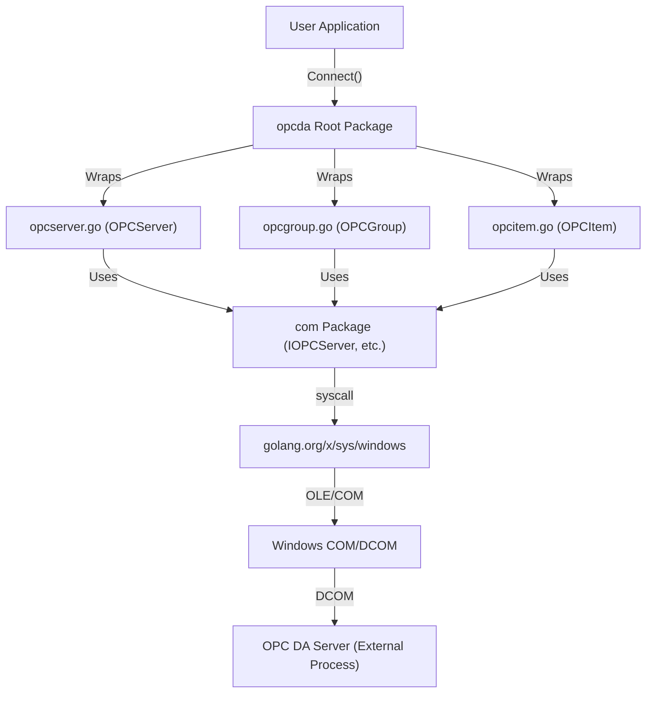
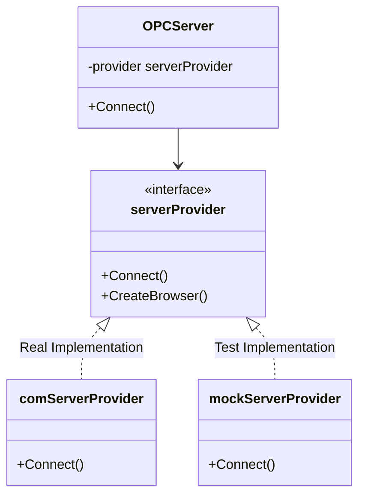

# Architecture: opcda (Go OPC DA Client)

This document describes the architectural design of the `opcda` library, a Go-based client for OPC DA (Data Access) servers using the COM/OLE Automation interface.

> 🛑 **Governance**: This document is **Read-Only** during Execution.
> *   **Edits**: Only permitted during the **Planning/Audit** phase by **High-Reasoning Models**.
> *   **Process**: Modifications require a specific `implementation_plan.md` and explicit **User Approval**.

## 🏗️ High-Level Architecture

The library is structured into four main layers, leveraging a **Provider Pattern** for dependency injection and testability:

1.  **User API Layer**: High-level Go structs (`OPCServer`, `OPCGroup`, `OPCItem`) that provide a clean, idiomatic Go interface.
2.  **Provider Interface Layer**: Internal Go interfaces (`serverProvider`, `groupProvider`, `browserProvider`) that abstract the underlying COM operations. This allows for swapping between real COM implementations and mocks.
3.  **COM Wrapper Layer**: Concrete implementations of providers (e.g., `comServerProvider`) that wrap specific OPC COM interfaces.
4.  **Base COM Layer (`com/` package)**: Low-level utilities for COM object creation, memory management, and data type conversion (VARIANT, SafeArray).

### Component Interaction Diagram



### 🧩 Provider Pattern Classes

To enable unit testing without a running OPC server, the library uses dependency injection via internal interfaces.



## 🧪 Test Strategy

The architecture supports two distinct testing strategies:

### 1. Unit Tests (Isolated)
*   **Command**: `go test ./...`
*   **Mechanism**: Uses `mock*Provider` implementations.
*   **Scope**: Verifies high-level logic, error handling, and state management without touching the OS COM runtime.
*   **Environment**: Runs on any OS (CI/CD friendly), though `golang.org/x/sys/windows` dependency mandates Windows build tags or environment.

### 2. Integration Tests (Live)
*   **Command**: `make integration`
*   **Tag**: `//go:build integration`
*   **Mechanism**: Uses `com*Provider` implementations to talk to a real local OPC server (e.g., Graybox, Matrikon).
*   **Scope**: Verifies actual COM interoperability, marshalling, and timing.
*   **Environment**: Strictly requires Windows and a running OPC DA Server.

## 📂 Source Map & File Descriptions

### Root Package (`/`)
Main library entry point and high-level abstractions.

| File | Description |
| :--- | :--- |
| `opcserver.go` | Implements `OPCServer`. Handles server connection (`Connect`), browsing, and group creation. |
| `opcgroup.go` | Implements `OPCGroup`. Manages a collection of items and provides sync/async Read/Write methods. |
| `opcitem.go` | Implements `OPCItem`. Represents a single tag/item in the OPC server. |
| `opcitems.go` | Collection management for items within a group. |
| `datacallback.go` | Handles asynchronous data change notifications from the OPC server. |
| `opcbrowser.go` | Implementation of server address space browsing (`IOPCBrowseServerAddressSpace`). |
| `opcerror.go` | Custom error types and HRESULT mapping. |

### COM Package (`/com/`)
Low-level COM implementation details.

| File | Description |
| :--- | :--- |
| `com.go` | Core COM utilities: `CoCreateInstanceEx`, `MultiQI`, initialization, and memory management. |
| `variant.go` | Handles conversion between Go types and COM `VARIANT` types. |
| `safearray.go` | Handles COM `SafeArray` structures, used for passing arrays between Go and COM. |
| `IOPCServer.go` | Definition of the `IOPCServer` COM interface. |
| `IOPCGroupStateMgt.go` | Definition of the `IOPCGroupStateMgt` COM interface. |
| `IOPCItemMgt.go` | Definition of the `IOPCItemMgt` COM interface. |
| `system.go` | COM system constants and base interface definitions (`IUnknown`). |

## 🏗️ Structs & FFI Wrappers

The library bridges Go and Windows COM using low-level memory mapping and direct system calls.

### COM Interface Mapping (Vtbl)
COM interfaces are implemented as pointers to Virtual Method Tables (Vtbl). In Go, these are mirrored using structs that map the layout of these tables.

Example: **`IOPCServer`** mapping
```go
type IOPCServerVtbl struct {
    IUnknownVtbl           // Base interface methods
    AddGroup      uintptr  // Method pointers
    GetErrorString uintptr
    GetStatus      uintptr
    // ... metadata
}

type IOPCServer struct {
    *IUnknown              // Points to the wrapper instance
}
```

### FFI Pattern: `syscall.SyscallN`
The library executes COM methods by invoking their addresses directly from the Vtbl using `syscall.SyscallN`. This allows passing the `this` pointer as the first argument, adhering to the COM calling convention.

```go
// Direct FFI Call Pattern
r0, _, _ := syscall.SyscallN(
    v.Vtbl().GetStatus,             // Method address from Vtbl
    uintptr(unsafe.Pointer(v)),     // "this" pointer
    uintptr(unsafe.Pointer(&pStatus)), // Arguments
)
```

### Key Internal Structs

| Struct | Package | Description |
| :--- | :--- | :--- |
| `IUnknown` | `com` | Base COM interface struct containing the `LpVtbl` pointer. |
| `VARIANT` | `com` | A union-like structure for self-describing data types used by OLE Automation. |
| `SafeArray` | `com` | A multidimensional array structure that includes bounds and reference counting. |
| `MULTI_QI` | `com` | Used in `CoCreateInstanceEx` to request multiple interfaces in a single round-trip. |

## 📦 External Dependencies

The library relies on a minimal set of external dependencies to maintain performance and reduce bloat.

### Go Modules
| dependency | version | Purpose |
| :--- | :--- | :--- |
| `golang.org/x/sys` | `v0.30.0` | Low-level Windows API access (COM/OLE initialization, syscalls). |
| `github.com/stretchr/testify` | `v1.11.1` | Unit testing and assertions (Dev dependency). |

### System DLLs (via `ole32.dll` and `oleaut32.dll`)
The library directly calls functions from these Windows system libraries:
- **`ole32.dll`**: `CoCreateInstanceEx`, `CoInitializeEx`, `CoInitializeSecurity`.
- **`oleaut32.dll`**: `VariantClear`, `SafeArrayCreateVector`, `SysAllocString`.

## 🛠️ Core API & Methods

### OPCServer (`opcserver.go`)
The primary entry point for interacting with an OPC server.

- **`Connect(progID, node string)`**: Initializes a connection to the specified OPC server.
- **`GetOPCServers(node string)`**: Enumerates all available OPC DA servers on a specific node.
- **`CreateBrowser()`**: Returns an `OPCBrowser` for navigating the server's address space.
- **`GetOPCGroups()`**: Returns the `OPCGroups` collection for managing group objects.
- **`Disconnect()`**: Properly releases all COM resources and closes the connection.

### OPCGroup (`opcgroup.go`)
Manages a set of OPC items and handles data exchange.

- **`SyncRead(source, serverHandles)`**: Performs a synchronous read of item values.
- **`SyncWrite(serverHandles, values)`**: Performs a synchronous write of item values.
- **`AsyncRead(serverHandles)`**: Initiates an asynchronous read.
- **`AsyncWrite(serverHandles, values)`**: Initiates an asynchronous write.
- **`RegisterDataChange(ch)`**: Registers a channel to receive push-based data updates.

### OPCItem (`opcitem.go`)
Represents an individual data point (tag).

- **`Read(source)`**: Reads the current value, quality, and timestamp for the item. Returns an `error` if the read fails.
- **`Write(value)`**: Writes a new value to the tag. Returns an `error` if the write fails.
- **`GetQuality()`, `GetValue()`, `GetTimestamp()`**: Accessors for the last known state of the item. Now nil-safe (returns zero-values if the item is uninitialized).

### COM Utilities (`com/com.go`)
Low-level primitives for Windows COM interop.

- **`Initialize()`**: Initializes the COM library for the current thread (Multithreaded).
- **`MakeCOMObjectEx()`**: Creates a COM object on a local or remote machine.
- **`CoTaskMemFree()`**: Frees memory allocated by the COM task allocator.

## 📚 API Reference

### Connection Management

#### `func Connect(progID, node string) (*OPCServer, error)`
Connects to an OPC DA server by its ProgID on the specified node (hostname or IP). Use `"localhost"` for local connections.

#### `func GetOPCServers(node string) ([]*ServerInfo, error)`
Enumerates available OPC DA servers on the target node. `ServerInfo` contains `ProgID` and `ClsID`.

---

### Structs & Methods

#### `type OPCServer struct`
Represents a connection to an OPC Server.
*   **Struct Members**:
    *   `Name` (`string`): ProgID of the server.
    *   `Node` (`string`): Node name (machine name).
    *   `clientName` (`string`): Name of the client application.
    *   `location` (`com.CLSCTX`): Context in which the server is running (Local/Remote).
    *   `groups` (`*OPCGroups`): Collection of OPC groups.
    *   `provider` (`serverProvider`): Interface for server operations.
    *   `container` (`*com.IConnectionPointContainer`): COM connection point container.
    *   `point` (`*com.IConnectionPoint`): COM connection point.
    *   `event` (`*ShutdownEventReceiver`): Receiver for shutdown events.
    *   `cookie` (`uint32`): Connection cookie.

*   **`Disconnect() error`**: Closes connection and releases resources.
*   **`GetOPCGroups() *OPCGroups`**: Returns the collection of groups.
*   **`CreateBrowser() (*OPCBrowser, error)`**: Creates an address space browser.
*   **`GetStatus() (*com.ServerStatus, error)`**: Retrieves server status (state, time, version).
*   **`GetErrorString(errorCode int32) (string, error)`**: Converts an error code to a readable string.

#### `type OPCGroups struct`
Collection of `OPCGroup` objects.
*   **Struct Members**:
    *   `parent` (`*OPCServer`): Reference to the parent OPCServer.
    *   `groups` (`[]*OPCGroup`): Slice of OPCGroup objects.
    *   `provider` (`serverProvider`): Interface for server operations.
    *   `groupID` (`uint32`): Generating ID for groups.
    *   `defaultActive` (`bool`): Default active state for new groups.
    *   `defaultGroupUpdateRate` (`uint32`): Default update rate for new groups.
    *   `defaultDeadband` (`float32`): Default deadband for new groups.
    *   `defaultLocaleID` (`uint32`): Default locale ID for new groups.
    *   `defaultGroupTimeBias` (`int32`): Default time bias for new groups.

*   **`Add(name string) (*OPCGroup, error)`**: Creates and adds a new group.
*   **`Remove(serverHandle uint32) error`**: Removes a group by handle.
*   **`RemoveByName(name string) error`**: Removes a group by name.
*   **`GetOPCGroup(serverHandle uint32) (*OPCGroup, error)`**: Retrieves a group by handle.
*   **`Item(index int32) (*OPCGroup, error)`**: Retrieves a group by index.
*   **`GetCount() int`**: Returns the number of groups.

#### `type OPCGroup struct`
A container for OPC Items.
*   **Struct Members**:
    *   `parent` (`*OPCGroups`): Reference to the parent OPCGroups.
    *   `provider` (`serverProvider`): Interface for server operations.
    *   `groupProvider` (`groupProvider`): Interface for group operations.
    *   `clientGroupHandle` (`uint32`): Client handle for the group.
    *   `serverGroupHandle` (`uint32`): Server handle for the group.
    *   `groupName` (`string`): Name of the group.
    *   `revisedUpdateRate` (`uint32`): Actual update rate of the group.
    *   `items` (`*OPCItems`): Collection of items in the group.
    *   `container` (`*com.IConnectionPointContainer`): COM connection point container.
    *   `point` (`*com.IConnectionPoint`): COM connection point for events.
    *   `event` (`*DataEventReceiver`): Receiver for data events.
    *   `cookie` (`uint32`): Connection cookie.

*   **`Items() *OPCItems`**: Returns the `OPCItems` collection for this group.
*   **`SyncRead(source com.OPCDATASOURCE, serverHandles []uint32) ([]*com.ItemState, []int32, error)`**: Synchronously reads values.
*   **`SyncWrite(serverHandles []uint32, values []com.VARIANT) ([]int32, error)`**: Synchronously writes values.
*   **`AsyncRead(serverHandles []uint32, transactionID uint32) (cancelID uint32, errs []int32, err error)`**: Starts async read.
*   **`AsyncWrite(serverHandles []uint32, values []com.VARIANT, transactionID uint32) (cancelID uint32, errs []int32, err error)`**: Starts async write.
*   **`RegisterDataChange(ch chan *DataChangeCallBackData) error`**: Subscribes to data change events.

#### `type OPCItems struct`
Collection of `OPCItem` objects.
*   **Struct Members**:
    *   `parent` (`*OPCGroup`): Reference to the parent OPCGroup.
    *   `provider` (`serverProvider`): Interface for server operations.
    *   `itemMgtProvider` (`itemMgtProvider`): Interface for item management operations.
    *   `itemID` (`uint32`): Generating ID for items.
    *   `defaultRequestedDataType` (`com.VT`): Default data type for new items.
    *   `defaultAccessPath` (`string`): Default access path for new items.
    *   `defaultActive` (`bool`): Default active state for new items.
    *   `items` (`[]*OPCItem`): Slice of OPCItem objects.

*   **`AddItem(tag string) (*OPCItem, error)`**: Adds a single item by tag name.
*   **`AddItems(tags []string) ([]*OPCItem, []error, error)`**: Adds multiple items efficiently.
*   **`Remove(serverHandles []uint32)`**: Removes items by handle.
*   **`GetOPCItem(serverHandle uint32) (*OPCItem, error)`**: Retrieves an item by handle.
*   **`Validate(tags []string, ...) ([]error, error)`**: Checks if items are valid without adding them.

#### `type OPCItem struct`
Represents a single data point.
*   **Struct Members**:
    *   `parent` (`*OPCItems`): Reference to the parent OPCItems.
    *   `provider` (`serverProvider`): Interface for server operations.
    *   `groupProvider` (`groupProvider`): Interface for group operations.
    *   `itemMgtProvider` (`itemMgtProvider`): Interface for item management.
    *   `tag` (`string`): Item ID (tag name).
    *   `clientHandle` (`uint32`): Client handle.
    *   `serverHandle` (`uint32`): Server handle.
    *   `accessPath` (`string`): Access path.
    *   `accessRights` (`uint32`): Access rights.
    *   `isActive` (`bool`): Active state.
    *   `requestedDataType` (`com.VT`): Requested data type.
    *   `nativeDataType` (`com.VT`): Native data type.
    *   `value` (`interface{}`): Latest cached value.
    *   `quality` (`uint16`): Latest cached quality.
    *   `timestamp` (`time.Time`): Latest cached timestamp.

*   **`Read(source com.OPCDATASOURCE) (interface{}, uint16, time.Time, error)`**: Reads current value/quality/timestamp.
*   **`Write(value interface{}) error`**: Writes a value.
*   **`GetValue() interface{}`**: Returns last cached value.
*   **`GetQuality() uint16`**: Returns last cached quality.
*   **`GetTimestamp() time.Time`**: Returns last cached timestamp.

#### `type OPCBrowser struct`
Helper for navigating server address space.
*   **Struct Members**:
    *   `parent` (`*OPCServer`): Reference to the parent OPCServer.
    *   `provider` (`browserProvider`): Interface for browser operations.
    *   `filter` (`string`): Current browse filter.
    *   `dataType` (`uint16`): Requested data type for leaves.
    *   `accessRights` (`uint32`): Requested access rights for leaves.
    *   `names` (`[]string`): Cached list of names (branches or leaves).

*   **`MoveTo(branches []string) error`**: Moves to a specific path.
*   **`MoveUp() error`**: Moves one level up.
*   **`MoveToRoot()`**: Moves to root.
*   **`ShowBranches() error`**: Populates `names` with sub-branches.
*   **`ShowLeafs(flat bool) error`**: Populates `names` with items (leaves).
*   **`Item(index int) (string, error)`**: Gets name at index.

---

### Data Types

#### `type OPCError struct`
```go
type OPCError struct {
    ErrorCode    int32
    ErrorMessage string
}
```

#### `type OPCWrapperError struct`
Wraps underlying errors with additional context.
```go
type OPCWrapperError struct {
    Err  error
    Info string
}
```

1.  **User** calls `group.SyncRead()`.
2.  **`OPCGroup`** prepares a list of server handles for the items.
3.  **`OPCGroup`** calls the underlying `IOPCSyncIO.Read` COM method via the `com` package.
4.  **`com` package** uses `syscall.Syscall` to trigger the OLE/COM runtime.
5.  **OPC Server** returns `VARIANT` data.
6.  **`com/variant.go`** converts `VARIANT` to Go `interface{}`.
7.  **`OPCGroup`** returns the data to the **User**.
