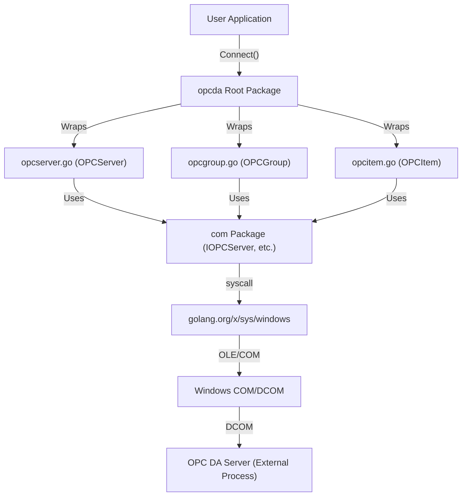

# Architecture: opcda (Go OPC DA Client)

This document describes the architectural design of the `opcda` library, a Go-based client for OPC DA (Data Access) servers using the COM/OLE Automation interface.

## 🏗️ High-Level Architecture

The library is structured into three main layers:

1.  **User API Layer**: High-level Go structs (`OPCServer`, `OPCGroup`, `OPCItem`) that provide a clean, idiomatic Go interface.
2.  **COM Wrapper Layer**: Go wrappers for specific OPC COM interfaces (e.g., `IOPCServer`, `IOPCItemMgt`).
3.  **Base COM Layer (`com/` package)**: Low-level utilities for COM object creation, memory management, and data type conversion (VARIANT, SafeArray).

### Component Interaction Diagram



## 📂 Source Map & File Descriptions

### Root Package (`/`)
Main library entry point and high-level abstractions.

| File | Description |
| :--- | :--- |
| `opcserver.go` | Implements `OPCServer`. Handles server connection (`Connect`), browsing, and group creation. |
| `opcgroup.go` | Implements `OPCGroup`. Manages a collection of items and provides sync/async Read/Write methods. |
| `opcitem.go` | Implements `OPCItem`. Represents a single tag/item in the OPC server. |
| `opcitems.go` | Collection management for items within a group. |
| `datacallback.go` | Handles asynchronous data change notifications from the OPC server. |
| `opcbrowser.go` | Implementation of server address space browsing (`IOPCBrowseServerAddressSpace`). |
| `opcerror.go` | Custom error types and HRESULT mapping. |

### COM Package (`/com/`)
Low-level COM implementation details.

| File | Description |
| :--- | :--- |
| `com.go` | Core COM utilities: `CoCreateInstanceEx`, `MultiQI`, initialization, and memory management. |
| `variant.go` | Handles conversion between Go types and COM `VARIANT` types. |
| `safearray.go` | Handles COM `SafeArray` structures, used for passing arrays between Go and COM. |
| `IOPCServer.go` | Definition of the `IOPCServer` COM interface. |
| `IOPCGroupStateMgt.go` | Definition of the `IOPCGroupStateMgt` COM interface. |
| `IOPCItemMgt.go` | Definition of the `IOPCItemMgt` COM interface. |
| `system.go` | COM system constants and base interface definitions (`IUnknown`). |

## 🏗️ Structs & FFI Wrappers

The library bridges Go and Windows COM using low-level memory mapping and direct system calls.

### COM Interface Mapping (Vtbl)
COM interfaces are implemented as pointers to Virtual Method Tables (Vtbl). In Go, these are mirrored using structs that map the layout of these tables.

Example: **`IOPCServer`** mapping
```go
type IOPCServerVtbl struct {
    IUnknownVtbl           // Base interface methods
    AddGroup      uintptr  // Method pointers
    GetErrorString uintptr
    GetStatus      uintptr
    // ... metadata
}

type IOPCServer struct {
    *IUnknown              // Points to the wrapper instance
}
```

### FFI Pattern: `syscall.SyscallN`
The library executes COM methods by invoking their addresses directly from the Vtbl using `syscall.SyscallN`. This allows passing the `this` pointer as the first argument, adhering to the COM calling convention.

```go
// Direct FFI Call Pattern
r0, _, _ := syscall.SyscallN(
    v.Vtbl().GetStatus,             // Method address from Vtbl
    uintptr(unsafe.Pointer(v)),     // "this" pointer
    uintptr(unsafe.Pointer(&pStatus)), // Arguments
)
```

### Key Internal Structs

| Struct | Package | Description |
| :--- | :--- | :--- |
| `IUnknown` | `com` | Base COM interface struct containing the `LpVtbl` pointer. |
| `VARIANT` | `com` | A union-like structure for self-describing data types used by OLE Automation. |
| `SafeArray` | `com` | A multidimensional array structure that includes bounds and reference counting. |
| `MULTI_QI` | `com` | Used in `CoCreateInstanceEx` to request multiple interfaces in a single round-trip. |

## 📦 External Dependencies

The library relies on a minimal set of external dependencies to maintain performance and reduce bloat.

### Go Modules
| dependency | version | Purpose |
| :--- | :--- | :--- |
| `golang.org/x/sys` | `v0.30.0` | Low-level Windows API access (COM/OLE initialization, syscalls). |
| `github.com/stretchr/testify` | `v1.11.1` | Unit testing and assertions (Dev dependency). |

### System DLLs (via `ole32.dll` and `oleaut32.dll`)
The library directly calls functions from these Windows system libraries:
- **`ole32.dll`**: `CoCreateInstanceEx`, `CoInitializeEx`, `CoInitializeSecurity`.
- **`oleaut32.dll`**: `VariantClear`, `SafeArrayCreateVector`, `SysAllocString`.

## 🛠️ Core API & Methods

### OPCServer (`opcserver.go`)
The primary entry point for interacting with an OPC server.

- **`Connect(progID, node string)`**: Initializes a connection to the specified OPC server.
- **`GetOPCServers(node string)`**: Enumerates all available OPC DA servers on a specific node.
- **`CreateBrowser()`**: Returns an `OPCBrowser` for navigating the server's address space.
- **`GetOPCGroups()`**: Returns the `OPCGroups` collection for managing group objects.
- **`Disconnect()`**: Properly releases all COM resources and closes the connection.

### OPCGroup (`opcgroup.go`)
Manages a set of OPC items and handles data exchange.

- **`SyncRead(source, serverHandles)`**: Performs a synchronous read of item values.
- **`SyncWrite(serverHandles, values)`**: Performs a synchronous write of item values.
- **`AsyncRead(serverHandles)`**: Initiates an asynchronous read.
- **`AsyncWrite(serverHandles, values)`**: Initiates an asynchronous write.
- **`RegisterDataChange(ch)`**: Registers a channel to receive push-based data updates.

### OPCItem (`opcitem.go`)
Represents an individual data point (tag).

- **`Read(source)`**: Reads the current value, quality, and timestamp for the item. Returns an `error` if the read fails.
- **`Write(value)`**: Writes a new value to the tag. Returns an `error` if the write fails.
- **`GetQuality()`, `GetValue()`, `GetTimestamp()`**: Accessors for the last known state of the item. Now nil-safe (returns zero-values if the item is uninitialized).

### COM Utilities (`com/com.go`)
Low-level primitives for Windows COM interop.

- **`Initialize()`**: Initializes the COM library for the current thread (Multithreaded).
- **`MakeCOMObjectEx()`**: Creates a COM object on a local or remote machine.
- **`CoTaskMemFree()`**: Frees memory allocated by the COM task allocator.

## 🔄 Data Flow: Synchronous Read

1.  **User** calls `group.SyncRead()`.
2.  **`OPCGroup`** prepares a list of server handles for the items.
3.  **`OPCGroup`** calls the underlying `IOPCSyncIO.Read` COM method via the `com` package.
4.  **`com` package** uses `syscall.Syscall` to trigger the OLE/COM runtime.
5.  **OPC Server** returns `VARIANT` data.
6.  **`com/variant.go`** converts `VARIANT` to Go `interface{}`.
7.  **`OPCGroup`** returns the data to the **User**.
