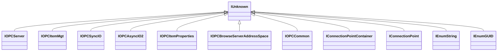

# COM Package Source Map

This document provides a map of the `com` package, which handles low-level Windows COM interactions for the OPC DA client.

## Package Architecture

The `com` package abstracts Windows COM interfaces using `golang.org/x/sys/windows`. Each COM interface is represented as a struct embedding `*IUnknown`.

## File Map

| File | Purpose |
| :--- | :--- |
| [com.go](file:///c:/Users/WSALIGAN/code/opcda/com/com.go) | Core COM initialization, `IUnknown`, and base utilities. |
| [variant.go](file:///c:/Users/WSALIGAN/code/opcda/com/variant.go) | OLE Automation `VARIANT` handling. `Value()` now returns `(interface{}, error)` for safe conversion. |
| [safearray.go](file:///c:/Users/WSALIGAN/code/opcda/com/safearray.go) | `SafeArray` handling for array data types. |
| [IOPCServer.go](file:///c:/Users/WSALIGAN/code/opcda/com/IOPCServer.go) | `IOPCServer` interface for server-level operations. |
| [IOPCItemMgt.go](file:///c:/Users/WSALIGAN/code/opcda/com/IOPCItemMgt.go) | `IOPCItemMgt` interface for group and item management. |
| [IOPCSyncIO.go](file:///c:/Users/WSALIGAN/code/opcda/com/IOPCSyncIO.go) | `IOPCSyncIO` interface for synchronous I/O. |
| [IOPCAsyncIO2.go](file:///c:/Users/WSALIGAN/code/opcda/com/IOPCAsyncIO2.go) | `IOPCAsyncIO2` interface for asynchronous I/O. |
| [IOPCItemProperties.go](file:///c:/Users/WSALIGAN/code/opcda/com/IOPCItemProperties.go) | `IOPCItemProperties` interface for item attributes. |
| [IOPCBrowseServerAddressSpace.go](file:///c:/Users/WSALIGAN/code/opcda/com/IOPCBrowseServerAddressSpace.go) | `IOPCBrowseServerAddressSpace` for address space navigation. |
| [IOPCCommon.go](file:///c:/Users/WSALIGAN/code/opcda/com/IOPCCommon.go) | `IOPCCommon` for session-wide settings like Locales. |
| [system.go](file:///c:/Users/WSALIGAN/code/opcda/com/system.go) | Connection point interfaces for event handling. |

## Interface Hierarchy

## Key Types

- **`VARIANT`**: The universal data container for COM.
- **`SafeArray`**: Used for passing arrays of data.
- **`IUnknown`**: The base interface for all COM objects.
- **`ItemState`**: A unified struct representing the value, quality, and timestamp of an OPC item.

## Pointer Safety & Syscalls

The package utilizes `unsafe.Pointer` for COM interop. To ensure compatibility with Go's `go vet` tool and runtime safety:
- **Immediate Casting**: `uintptr` results from syscalls are cast to `unsafe.Pointer` immediately to ensure the compiler can track the pointer's origin.
- **Standardized Patterns**: Functions like `SysAllocStringLen` use `syscall.Syscall` directly for better static analysis tracking compared to `proc.Call`.
